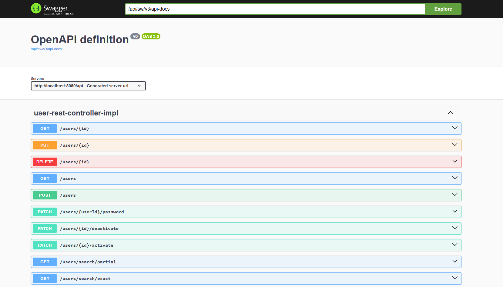

<h1 id="top" align="center">🚢 v1.0.0 🚢</h1> 

<br/>

## 🔍 Table of Contents

- [Software Versions](#software-versions)
- [Features](#features)
- [Next Release Features](#next-release-features)
- [System Startup](#system-startup)
  - [Developer Mode](#developer-mode)
  - [Production Mode](#production-mode)
- [Endpoint Documentation](#endpoint-documentation)
- [Test](#test)
 
<br/>

<h2 id="software-versions">🏷️ Software Versions</h2>

| Software     | Version    |
|--------------|------------|
| Java         | 23         |
| Spring Boot  | 3.4.0      |
| Apache Maven | 3.9.5      |
| Swagger      | 2.7.0      |
| Lombok       | 1.18.36    |

<br/>

<h2 id="features">🔥 Features</h2>

+ **Relational Database Management:** Efficient handling of relational data with ORM, supporting one-to-one, one-to-many, and many-to-many relationships.
+ **Hot Reload:** Changes in the codebase can be instantly reflected without needing to restart the application.
+ **Environment Configuration:** Configurations have been adjusted for enhanced flexibility.
+ **AOP:** Aspect-Oriented Programming handles authentication and authorization separately from business logic, ensuring security across the application.
+ **Lombok:** Lombok is used to eliminate boilerplate code for better readability and maintainability.
+ **JWT Authentication:** User authentication and authorization are managed with JSON Web Tokens for secure, stateless sessions.
+ **Exceptions:** The application manages both custom and global exceptions for error handling.
+ **Swagger Documentation:** Comprehensive API documentation integrated for documentation and testing purposes.
+ **Dockerization:** The application is containerized for consistent deployment and scaling.
+ **Automated & Manual Testing:** Both automated and manual tests implemented for quality assurance.

<br/>

<h2 id="next-release-features">🚧 Next Release Features</h2>

- PostgreSQL integration.
- Plain response.
- Remove precedence key.
- Add Dto.
- Implement isDeleted.

<br/>

<h2 id="system-startup">🚀 System Startup</h2> 

<h3 id="developer-mode">🧪 Developer Mode</h3>

```
mvnw spring-boot:run
```

<br/>

<h3 id="production-mode">⚡Production Mode</h3> 

* Create a new directory named `core`.
* Clone the [`core-docker-config`](https://github.com/ahmettoguz/core-docker-config) and [`core-java-spring-boot-rest-api`](https://github.com/ahmettoguz/core-java-spring-boot-rest-api) repositories into the `core` directory.
```
git clone https://github.com/ahmettoguz/core-docker-config
git clone https://github.com/ahmettoguz/core-java-spring-boot-rest-api
```

* Copy `application-dev.properties` to create `application-prod.properties`. Refer to `production-example.txt` for guidance.
* Refer to the documentation provided in the [`core-docker-config`](https://github.com/ahmettoguz/core-docker-config) project for the system startup commands.

<br/>

<h2 id="endpoint-documentation">📍 Endpoint Documentation</h2>
You can access the full API documentation using Swagger UI.

To view the documentation visit: [`sw/swagger-ui/index.html`](https://localhost/sw/swagger-ui/index.html)



<br/>

<h2 id="test">🔬 Test </h2>

Check out the [`core-mocha-api-automation-test`](https://github.com/ahmettoguz/core-mocha-api-automation-test) repository for both automation and manual tests.

### [🔝](#top)
